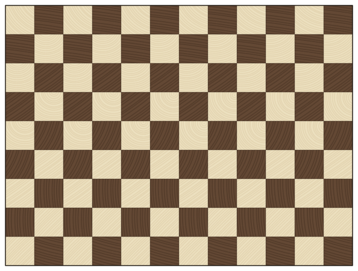
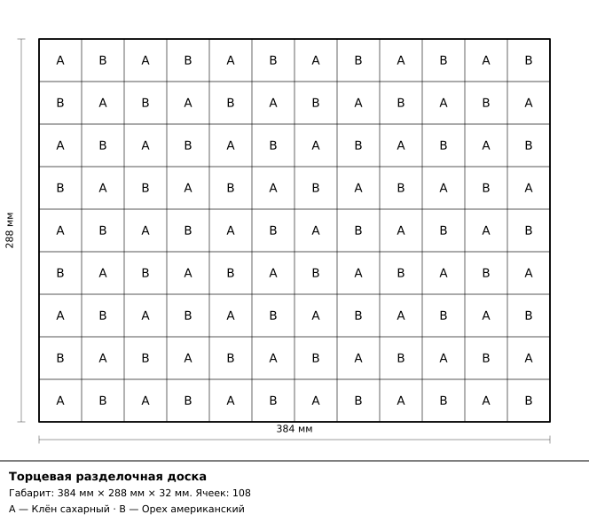
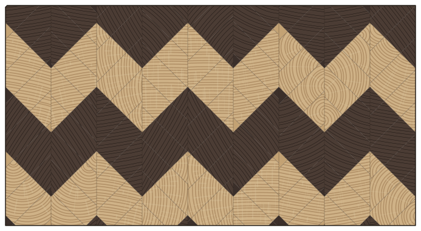
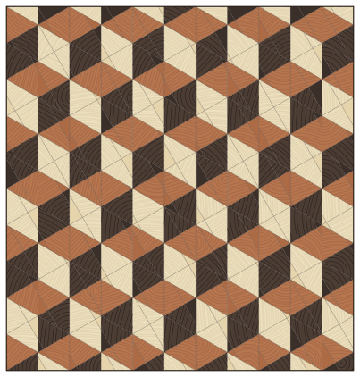

# BoardForge

Генератор узоров для торцевых разделочных досок — не рисовалка, а инструмент,
по результату которого столяр действительно изготавливает доску: узор, карта
раскроя, список в магазин, себестоимость, пошаговая инструкция и чертёж на
офисном лазернике.



*Демо-проект `01-checkerboard-classic` — торцевая текстура выводится из происхождения каждой ячейки: из какой рейки и с какого места по её длине.*

## Главная идея

**Доска — это программа, а не картинка.**

Проект хранится последовательностью столярных операций:

```
Glue  →  Crosscut  →  StandOnEnd  →  Cut  →  Assemble  →  Crop
склеить   торцевать    поставить     рез      собрать     обрезать
щит       поперёк      на торец      под      новый       в размер
                                     углом    щит
```

Шесть операций — весь словарь. `Cut` идёт только после `StandOnEnd`, потому
что до торцовки и после неё угол реза — разные сущности, и валидатор это
знает.

Узор, раскрой, расход материала и инструкция **выводятся** из этой программы,
а не рисуются отдельно. Из чего следует главное практическое свойство:

> Сгенерировать неизготовимый узор физически невозможно.

Нельзя нарисовать доску, которую нельзя склеить, потому что рисунка как
исходных данных не существует — есть только операции, а картинка получается
их исполнением. Если узор не собирается, валидатор объясняет словами, какая
операция и почему не проходит, с привязкой к её номеру.

## Что он умеет

- **14 параметрических узоров**: шахматка, полосы, кирпич, ёлочка, шеврон,
  ромбы, мельница, зигзаг, плетёнка, кубы и другие
- **12 пород** со справочными плотностью и усушкой, торцевой текстурой
  (годичные кольца и сердцевинные лучи) и подобранными палитрами
- **Обратная задача по габаритам**: сказать «хочу 400 × 300 мм» — программа
  сама подберёт параметры и **измерит** попадание исполнением
- **Расчёт материала** с пропилом, строганием и обрезкой кромок: без этих
  трёх припусков расчёт считается багом, а не приближением
- **Карта раскроя** из мерных досок, разбивка потерь, себестоимость
- **Пошаговая инструкция** — по кадру на операцию, с картинкой верстака
  после каждой
- **Чёрно-белый чертёж** с размерами, буквами пород и штампом
- **3D-просмотр** доски с фаской и маслом. Своего JavaScript мы не пишем
  ни строки: меш собирает Python, показывает готовый `<model-viewer>`
- **Печать в PDF** тем же вектором, что ушёл на экран
- **Генератор** случайных и эволюционных узоров по фитнес-функции
- **Картинка → доска** через квантование в CIELAB

## Установка

Нужен [uv](https://docs.astral.sh/uv/) и Python 3.13 (закреплён в
`.python-version`; `uv` поставит его сам).

```bash
git clone https://github.com/papsuevgeorgiy-ux/boardforge
cd boardforge
uv sync
```

Проверить, что всё встало:

```bash
uv run pytest -m "not slow"
```

## С чего начать

Веб-интерфейс — основной способ работы:

```bash
uv run boardforge serve
```

Открыть демо-проект из комплекта:

```bash
uv run boardforge serve --project projects/01-checkerboard-classic.json
```

Собрать распечатку в мастерскую — чертёж, раскрой, закупку и смету:

```bash
uv run boardforge workshop --project projects/05-chevron-oak.json --pdf
```

Кладёт в `out/workshop/`: `workshop.html`, `blueprint.svg`, `workshop.pdf`.



*Чёрно-белый чертёж: размеры, буквы пород по ячейкам, штамп. Печатается
на офисном лазернике — цветной рендер для превью, этот для работы.*

## Демо-проекты

В `projects/` лежат шесть готовых проектов по возрастанию сложности
изготовления. Это обычные файлы проекта — их можно открыть, поправить
и сохранить.

| Файл | Узор | Доска | Что показывает |
|---|---|---|---|
| `01-checkerboard-classic.json` | Шахматка | 384 × 288 | самое простое: прямые резы, один щит |
| `02-stripes-breakfast.json` | Полосы | 392 × 252 | три породы, ритм по ширине |
| `03-brick-walnut.json` | Кирпичная кладка | 360 × 270 | сдвиг рядов |
| `04-diamonds-padauk.json` | Ромбы | 338 × 338 | узор собирается из смещений |
| `05-chevron-oak.json` | Шеврон | 450 × 242 | **угловой рез**, схождение по шву |
| `06-cubes-showpiece.json` | Кубы | 324 × 340 | два угловых реза, два щита-близнеца, 18 операций |

Размеры в миллиметрах, чистовые.



*`05-chevron-oak` — угловой рез: ячейки здесь параллелограммы, а не клетки
сетки. Шов обязан сойтись, и за этим следит тест, а не глаз.*



*`06-cubes-showpiece` — мозаика падающих блоков: два угловых реза и два
щита-близнеца, 18 операций (Р23).*

Пересобрать комплект: `uv run python tools/demo_projects.py`

## Команды

```bash
uv run boardforge serve          # веб-интерфейс
uv run boardforge workshop       # распечатка в мастерскую
uv run boardforge generate       # случайный узор по сиду (--evolve — отбор)
uv run boardforge image фото.png # картинка → доска
uv run boardforge swatches       # лист образцов пород
uv run boardforge contact-sheet  # все узоры одной страницей
uv run boardforge examples       # демо-доски по файлам
uv run boardforge --help
```

## Честные границы

Инструмент считает столярную работу, а не изображает её. Поэтому важно прямо
сказать, где проходит край — и что за ним.

**Обратная задача решается только для ортогональных случаев.** Перевести
готовый растр в программу операций получается там, где резы прямые. Для
угловых узоров — шеврона, ёлочки, кубов — общего решения нет, и вместо него
даны параметрические генераторы: узор задаётся углом, шагом и числом повторов,
а не рисуется. Решение и его причина — в `docs/decisions.md`.

**Карта раскроя не моделирует ширину рейки и занижает метраж.** Раскрой
одномерный: кроится длина, ширина не укладывается. Занижение — сторона
**опасная**, а не безопасная, и назвать её «запасом» значит соврать:
по такому плану можно купить слишком мало, приехать из магазина и встать.
Метраж на странице закупки — нижняя граница; запас закладывайте сверху (Р27).

**Цены — порядок величины, и они живут в коде.** `DEFAULT_PRICE_PER_M3`
в `calc/estimate.py`. Прайс — свойство рынка, а не доски (Р26): он зависит
от города, поставщика и месяца. Себестоимость на распечатке отвечает
на вопрос «тысячи или десятки тысяч», а не «сколько отдать в кассу».
Править цены из интерфейса нельзя — это признанный долг, а не замысел.

**Палитры пород подобраны на глаз, числа — по справочникам.** Плотность
и усушка сверены по Wood Handbook (FPL-GTR-282) и The Wood Database,
источники записаны в шапке `core/species.yaml` и зафиксированы тестом.
А вот **цвета** не снимались с фотографий и не мерились
колориметром: их подбирали, глядя на лист образцов
(`uv run boardforge swatches`). Для выбора сочетания пород этого хватает,
для попадания в оттенок конкретной доски — нет.

**Ещё по мелочи, чтобы не было сюрпризов:**

- PDF требует системного GTK (WeasyPrint). Без него ляжет только печать,
  остальное работает; команда установки — в тексте отказа
- распечатка кубов собирается около шести секунд: 18 шагов, у заготовок
  по 300–400 ячеек
- проект живёт в памяти процесса и сохраняется кнопкой в файл; базы нет

## Как это устроено

```
core/    операции, геометрия, породы, валидатор,   ← без I/O и без UI
         обратная задача по габаритам
  ↓
calc/    раскрой, материалы, отходы, себестоимость
  ↓
render/  SVG (2D), trimesh → .glb (3D)
  ↓
io/      проект (JSON), PDF, инструкция, распечатка
  ↓
web/ cli/  оболочки
```

Ячейки узора — **произвольные полигоны**, не клетки сетки: угловые резы дают
параллелограммы, и работа идёт через `shapely`. Рез — это пересечение
с полосой, пересборка — аффинное преобразование. Двумерных массивов цветов
в ядре нет.

Внутри ядра всегда миллиметры и `float`; дюймы — только на границе
ввода-вывода. Все размеры в программе **чистовые**: пропил, строгание
и обрезка кромок в геометрию не входят, а вычисляются обратным ходом
в `calc/`. Поэтому смена диска на тонкий меняет расход материала,
но не рисунок.

Подробнее: `docs/architecture.md` — слои и решения, `docs/domain.md` —
столярная модель, `docs/decisions.md` — принятые решения по спорным местам
(имеет приоритет над остальными документами).

## Стек

Python-first: ядро без единой UI-зависимости, весь интерфейс тоже Python.

`shapely` + `numpy` (геометрия) · FastAPI + Jinja2 + HTMX (веб) ·
собственный SVG-writer без библиотек · `trimesh` → GLB + `<model-viewer>` (3D) ·
WeasyPrint (PDF) · `argparse` (CLI) · `pytest` + `hypothesis` · `ruff`

HTMX и просмотрщик 3D лежат в репозитории локально: **работает без сети** —
заявленное свойство, а не побочный эффект.

## Тесты

```bash
uv run pytest -m "not slow"   # быстрый набор, около трёх минут
uv run pytest                 # полный набор
```

Полный прогон заметно дольше быстрого: дороже всего обходятся кубы — два
угловых реза и два щита-близнеца. Что помечено `slow` и почему именно оно —
в `tests/conftest.py`, разметка выведена из замера, а не из ощущений.

Главный тест — на изготовимость: любой сгенерированный узор обязан
воспроизводиться из своей программы бит-в-бит.

## Ограничение по происхождению

Недельный спринт, один разработчик. Проект рабочий, но молодой: острые углы
описаны выше честно и полностью, известные проблемы — в `docs/PROJECT.md`.
